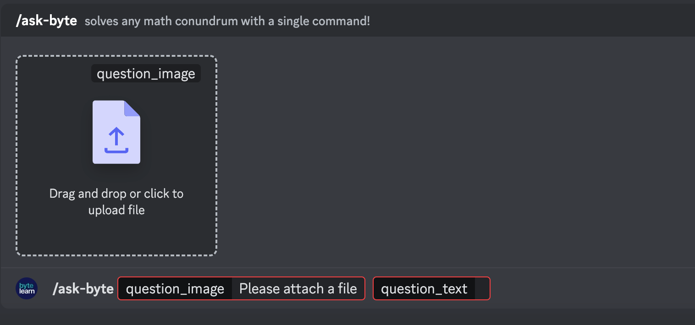

# **Bytelearn Bot**

Welcome to Bytelearn Bot, your personal math problem-solving assistant on Discord! This bot is designed to provide you with full solutions to various math problems.

?>**Need help or stuck?** Join our discord server [here](https://discord.gg/jJMNGkQGnT)!

The bot is powered by the Bytelearn app (more info [here](https://bytelearn.com)) to give answers directly within Discord. The bot may have limitations and errors and we are happy to help with any confusion or suggestions you may have. For more information on support or credits, go to [Support](support.md).

 

**How to Ask a Math Question**

**Using Prefixes:**
Type your Math problem starting with the prefix question or `“Question:”` This is probably the most efficient way in asking your problem.

>**For example:**
`Question: What is 2+2?`
 If your question includes an image of the problem, simply attach the image after the prefix. The bot is capable of interpreting and solving math problems from images as well. 

**Using the Slash Command:**
`</ask-byte>`

+ Initiate a command by typing `/` in the chat. The `ask-byte` command should appear in the suggestion box. Select it or type `/ask-byte` to activate.
+ You will be presented with two options: `question_image` and `question_text`.
	+ `question_text`: Use this to manually type in your question and receive the answer
	+ `question_image`: Use this to submit an image of your problem and receive the answer
+ If your image needs additional context or if the image contains the entire problem statement and you wish to add more details, first upload the image, then select `question_text` to type in any supplementary information. *Ensure all text is entered in the prompted input box, not the general chat.*

?>**Important Tips**
 • The problem you ask should contain the instructions for what needs to be done. Incomplete problem statements produce poor-quality solutions.
 • Ask one problem at a time. Asking multiple questions or lengthy questions might not give optimal results.
 • The bot cannot solve problems that involve graphs, tables, and diagrams.

**User Limits**

Each user is allowed to ask up to 10 questions per day to manage demand and ensure quality responses.